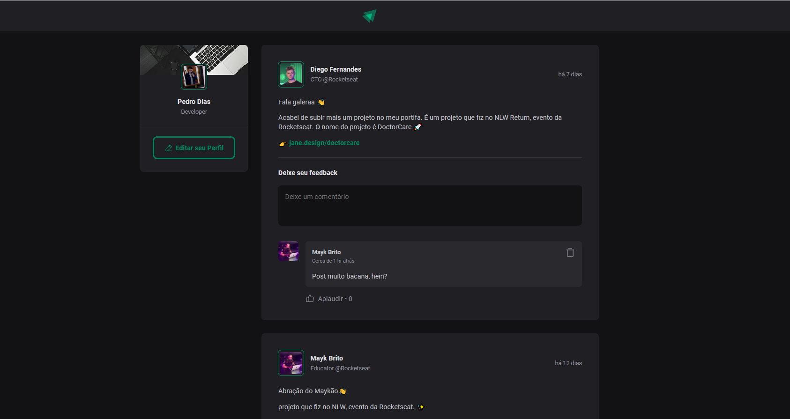

<h1 align="center">
   Ignite Feed 
</h1>

<div align="center">
  <a href="#-Technologies"><b>Technologies</b></a>&nbsp;&nbsp;&nbsp;|&nbsp;&nbsp;&nbsp;
  <a href="#-Project"><b>Project</b></a>&nbsp;&nbsp;&nbsp;
</div>

<br></br>

<div align="center">
  
</div>

## 🚀 Getting started

Clone the project and access the folder.

```bash
$ git clone https://github.com/diaspd/ignite-feed.git
$ cd 
```

Follow the steps below:
```bash
# Install the dependencies
$ npm i

# Start the project
$ npm run dev
```
The app will be available for access on your browser at `http://localhost:5174`

<br></br>

## 💻 Technologies

This project was developed with the following technologies:
<b>
- TypeScript
- ReactJs
</b>

</br>

## 📄 Project
💰 A project like a feed of social network.

<br></br>

Made with ♥ by Pedro Dias. 👋 Follow me on social media!<br></br>

If you can give a little star, I appreciate it 🤩
